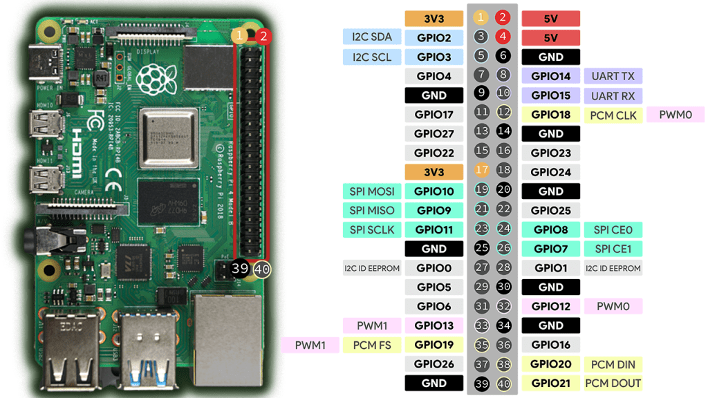

* git clone https://github.com/raspberrypi/utils.git

* cd pinctrl

* sudo apt install cmake

* cat README.md
cmake .
make 
sudo make install


* After compile/link , you could use pinctrl
```
ruby@raspberrypi:~/src/utils/pinctrl $ pinctrl 
 0: ip    -- | hi // ID_SDA/GPIO0 = input
 1: ip    -- | hi // ID_SCL/GPIO1 = input
 2: ip    -- | hi // SDA1/GPIO2 = input
 3: ip    -- | hi // SCL1/GPIO3 = input
 4: ip    -- | hi // GPIO_GCLK/GPIO4 = input
 5: ip    -- | hi // GPIO5 = input
 6: ip    -- | hi // GPIO6 = input
 7: op -- -- | hi // SPI_CE1_N/GPIO7 = output
 8: op -- -- | hi // SPI_CE0_N/GPIO8 = output
 9: a0    -- | lo // SPI_MISO/GPIO9 = SPI0_MISO
10: a0    -- | lo // SPI_MOSI/GPIO10 = SPI0_MOSI
11: a0    -- | lo // SPI_SCLK/GPIO11 = SPI0_SCLK
12: ip    -- | lo // GPIO12 = input
13: ip    -- | lo // GPIO13 = input
14: a5    -- | hi // TXD1/GPIO14 = TXD1
15: a5    -- | hi // RXD1/GPIO15 = RXD1
16: ip    -- | lo // GPIO16 = input
17: ip    -- | lo // GPIO17 = input
18: ip    -- | lo // GPIO18 = input
19: ip    -- | lo // GPIO19 = input
20: ip    -- | lo // GPIO20 = input
21: ip    -- | lo // GPIO21 = input
22: ip    -- | lo // GPIO22 = input
23: ip    -- | lo // GPIO23 = input
24: ip    -- | lo // GPIO24 = input
25: ip    -- | lo // GPIO25 = input
26: ip    -- | lo // GPIO26 = input
27: ip    -- | lo // GPIO27 = input
28: ip    -- | hi // HDMI_HPD_N/GPIO28 = input
29: op -- -- | lo // STATUS_LED_N/GPIO29 = output
30: a3    -- | lo // CTS0/GPIO30 = CTS0
31: a3    -- | lo // RTS0/GPIO31 = RTS0
32: a3    -- | hi // TXD0/GPIO32 = TXD0
33: a3    -- | hi // RXD0/GPIO33 = RXD0
34: a3    -- | hi // SD1_CLK/GPIO34 = SD1_CLK
35: a3    -- | hi // SD1_CMD/GPIO35 = SD1_CMD
36: a3    -- | hi // SD1_DATA0/GPIO36 = SD1_DAT0
37: a3    -- | hi // SD1_DATA1/GPIO37 = SD1_DAT1
38: a3    -- | hi // SD1_DATA2/GPIO38 = SD1_DAT2
39: a3    -- | hi // SD1_DATA3/GPIO39 = SD1_DAT3
40: op -- -- | lo // CAM_GPIO1/GPIO40 = output
41: op -- -- | hi // WL_ON/GPIO41 = output
42: op -- -- | hi // BT_ON/GPIO42 = output
43: a0    -- | hi // WIFI_CLK/GPIO43 = GPCLK2
44: ip    -- | hi // SDA0/GPIO44 = input
45: ip    -- | hi // SCL0/GPIO45 = input
46: ip    -- | hi // SMPS_SCL/GPIO46 = input
47: op -- -- | hi // SMPS_SDA/GPIO47 = output
48: a0    -- | lo // SD_CLK_R/GPIO48 = SD0_CLK
49: a0    -- | hi // SD_CMD_R/GPIO49 = SD0_CMD
50: a0    -- | hi // SD_DATA0_R/GPIO50 = SD0_DAT0
51: a0    -- | hi // SD_DATA1_R/GPIO51 = SD0_DAT1
52: a0    -- | hi // SD_DATA2_R/GPIO52 = SD0_DAT2
53: a0    -- | hi // SD_DATA3_R/GPIO53 = SD0_DAT3
```

* pinout
 


* datasheet
https://www.raspberrypi.org/app/uploads/2012/02/BCM2835-ARM-Peripherals.pdf

```
183 static void bcm2835_gpio_set_fsel(void *priv, unsigned gpio, const GPIO_FSEL_T func)
184 {
185     volatile uint32_t *base = priv;
186     /* GPFSEL0-5 with 10 sels per reg, 3 bits per sel (so bits 0:29 used) */
187     uint32_t reg = GPFSEL0 + (gpio / 10);
188     uint32_t lsb = (gpio % 10) * 3;
189     int fsel;
190
191     switch (func)
192     {
193     case GPIO_FSEL_INPUT: fsel = 0; break;
194     case GPIO_FSEL_OUTPUT: fsel = 1; break;
195     case GPIO_FSEL_FUNC0: fsel = 4; break;
196     case GPIO_FSEL_FUNC1: fsel = 5; break;
197     case GPIO_FSEL_FUNC2: fsel = 6; break;
198     case GPIO_FSEL_FUNC3: fsel = 7; break;
199     case GPIO_FSEL_FUNC4: fsel = 3; break;
200     case GPIO_FSEL_FUNC5: fsel = 2; break;
201     default:
202         return;
203     }
204
205     if (gpio < BCM2835_NUM_GPIOS)
206         base[reg] = (base[reg] & ~(0x7 << lsb)) | (fsel << lsb);
207
208     printf("%s:%d gpio:%d, base[reg]=0x%x, value:0x%x\n",__func__,__LINE__,
209         gpio,(unsigned int)(base+reg), (base[reg] & ~(0x7 << lsb)) | (fsel << lsb));
210 }
```


pdf page 92
