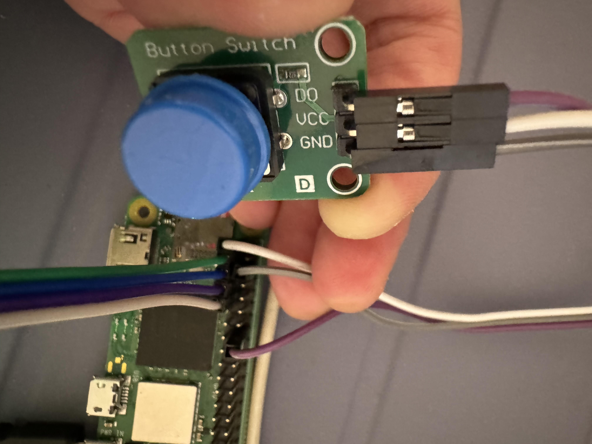

From https://data-flair.training/blogs/stacks-and-queues-in-c/

example:
queue_example.c

exercise:

使用test_gpio_bi_direction.c 為參考程式， 寫一個程式有以下功能。

1. 用陣列實作stack
2. 程式可以動態輸入參數,　自動作stack　insert
EX: ./test_queue  2 3 5 9 1 11 3 12 6    (learn argc,argv, atoi programming)
3. while 輸流快閃ｓｔａｃｋ　內的值的次數。 然後間隔1秒， 再閃下一個ｓｔａｃｋ內的值
  （也就是用閃燈代替ｄｉｓｐｌａｙ)           (push for stack)
4. 閃完如果按了ｐｕｓｈ　ｂｕｔｔｏｎ,　代表ｐｏｐ　ｓｔａｃｋ。 從sｔａｃｋ　中取值。 (pop for stack)
5. 不斷重覆　３~４, 直到程式結束。 
