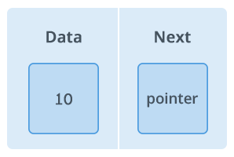

From https://www.hackerearth.com/practice/data-structures/linked-list/singly-linked-list/tutorial/#:~:text=In%20C%20language%2C%20a%20linked,address%20of%20the%20next%20node.

  

  

* kernel driver example   
https://hulc.xyz/2021/06/26/linux-kernel-list-for-each-entry-%E8%A7%A3%E6%9E%90/  
https://elixir.bootlin.com/linux/latest/source/include/linux/skbuff.h  

example:  
linking_list.c   
linking_list_addhead.c  

Q:程式有沒有什麼問題？

exercise:  
結合GPIO， 寫linking list程式。  
1. 能輸入數字，數字為要輸入成 linking list 的value
2. GPIO　traverse list 　閃燈，如果值為 ％3 餘0， 閃value次數的紅燈， %３為1， 閃value　次數的綠燈， %３為2， 閃value次數的藍燈。
3. 按push button可以刪除liking list的頭。 
4. 無限loop 1~3

